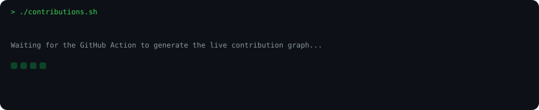

<div align="center">

# `Mohid-Abbas`

### AI • ROBOTICS • EMBEDDED SYSTEMS

> Building intelligent systems that connect AI with the physical world.


[GitHub](https://github.com/Mohid-Abbas) ·
[LinkedIn](https://www.linkedin.com/in/muhammad-mohid-abbas/) ·
[Email](mailto:mohidabbas.ai@gmail.com)

</div>

---

```text
mohid@github:~$ ./contributions.sh
```

<div align="center">

</div>

```text
mohid@github:~$ whoami
```

```text
USER       : Muhammad Mohid Abbas
ROLE       : BSAI Student
FOCUS      : AI / Robotics / Embedded Systems

STATUS     : Building intelligent systems

CURRENT STACK
├── Python / Machine Learning
├── Generative AI / RAG
├── AI Agents / LangGraph / n8n
├── ROS2
└── ESP32 / Embedded Systems
```

```text
mohid@github:~$ ls projects/
```

| Project | What it does |
|---|---|
| **MediDash** | Autonomous medical delivery robot |
| **RAG Document Assistant** | Retrieval-augmented AI system |
| **Saiyan AR** | Real-time gesture-controlled AR |
| **Synapse** | Wearable AI companion |

```text
mohid@github:~$ cat tech_stack/
```

**AI / ML** · Python · PyTorch · Machine Learning · Generative AI  
**AI Systems** · RAG · AI Agents · LangGraph · n8n  
**Robotics** · ROS2 · ESP32 · PID · Sensors  
**Tools** · Git · GitHub · Linux · VS Code

```text
mohid@github:~$ connect
```

[GitHub](https://github.com/Mohid-Abbas) ·
[LinkedIn](https://www.linkedin.com/in/muhammad-mohid-abbas/) ·
[Email](mailto:mohidabbas.ai@gmail.com)

<div align="center">

`Code • Build • Innovate`

</div>
